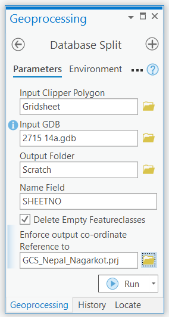
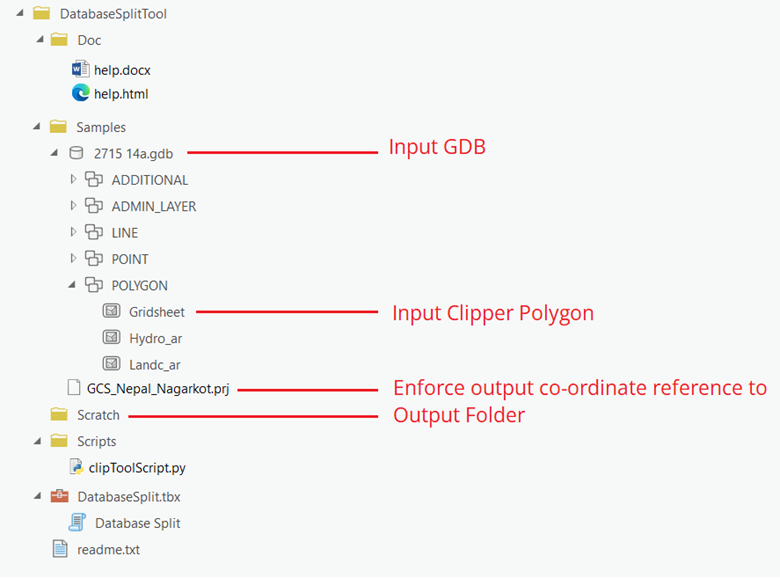
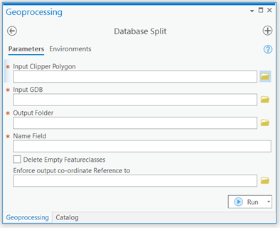
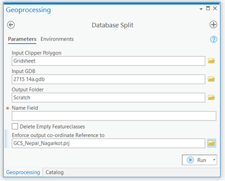
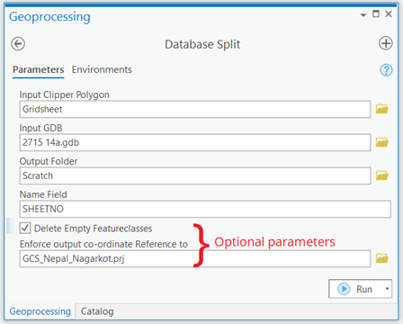
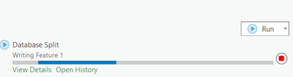
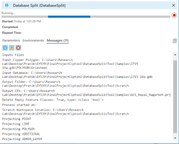
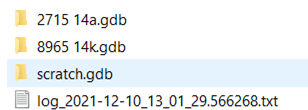

### This is a tool for ArcGIS pro.
	Built with ArcGIS pro 2.8.0
	Python version 3.4.3
Click [here](#1) to go to detailed help.

Click [here](#2) to go to tutorial.

This tool takes a larger geodatabase along with a polygon feature class that will be used to clip the the geodatabase. It has options of whether or not to delete empty feature classes from output geodatabases. Also if the user wants the output geodatabases to be in a certain Coordinate Reference System, a .prj file for that CRS can be provided as input. This .prj file is optional. If no such file is provided or if the file is invalid, the feature datasets output geodatabases will follow the CRS of corresponding feature datasets from input geodatabase. It works only for feature datasets and Point, Line, Polygon and Annotation files.

Inputs:
This script takes following inputs:<br>

* __input\_clip\_polygon__, which is a polygon featureclass that is used to clip a database
* __input\_GDB__, which is a large gdb to be clipped to smaller gdbs
* __output\_folder__, which is where the newly created smaller gdbs are stored
* __name\_field__, it is the field with unique values which will be used to name the output smaller gdbs
* __DIE__, it is a boolean which asks if empty featureclasses in output should be deleted or not
* __user\_defined\_CRS__, it is a _.prj_  file of co-ordinate reference system, to which user wants to output gdbs to be. It is an optional parameter. If not valid file is found, the CRS of input datasets will be used in output datasets.

This Tool comes with Sample Data
A gdb and a .prj file are in Sample folder.

Inside that gdb, within POLYGON feature dataset, a Gridsheet feature class is present which will be used as input clip polygon.
It has a field named __'SHEETNO'__ that will be used in Namefield.

.prj file is used as *prj\_file*
DIE can be checked for True and unchecked for False.

To call the tool using python,following syntax is used.

`DatabaseSplit (input_clip_polygon, input_GDB, output_folder, name_field, DIE, {user_defined_CRS})`


<a name = '1'></a>

<h2 style="color:blue;">Help</h2>

__Title__: Database Split Tool

### Description

This tool takes a larger geodatabase along with a polygon feature class that will be used to clip the the geodatabase. It has options of whether or not to delete empty feature classes from output geodatabases. Also if the user wants the output geodatabases to be in a certain Coordinate Reference System, a .prj file for that CRS can be provided as input. This .prj file is optional. If no such file is provided or if the file is invalid, the feature datasets output geodatabases will follow the CRS of corresponding feature datasets from input geodatabase. It works only for feature datasets and Point, Line, Polygon and Annotation files.

### Usage

<figure>
  <p>
  <figcaption>Figure 1: Tool with Inputs.</figcaption>
</figure>

It is very useful for extracting a small subset of large geodatabase or when the database is to be split into multiple smaller geodatabases. This can come handy for distributing, updating, managing and cleaning of geodatabases.

### Syntax

```python
DatabaseSplit (input_clip_polygon, input_GDB, output_folder, name_field, DIE, {user_defined_CRS})  
```
| Parameter         | Explanation | Data Type |
|--------------|:-----|-----------:|
| input\_clip\_polygon |  	Dialog Reference<br><br>It is a polygon feature class. If multiple polygons are present, the input gdb will be split to that many gdbs. It should have at least one unique name field, that can be used to name output databases. It is encouraged to have input clip polygon in same datum as the input gdb.<br><br>Python Reference<br><br>`input_clip_polygon = r'C:\Users\Lab\Databases\2715 14a.gdb\POLYGON\Gridsheet'`<br>|Feature Class |
| <br>input\_GDB |  	<br>Dialog Reference<br><br>It is the geodatabase which needs to be clipped. It can contain multiple feature datasets with multiple feature classes.<br><br>Python Reference<br><br>`input_GDB = r'C:\Users\Lab\Databases\2715 14a.gdb'`|<br>Workspace |
| <br>output\_folder |  	<br>Dialog Reference<br><br>This is the folder where outputs will be stored.<br><br>Python Reference<br><br>`output_folder = r'C:\Users\Lab\Outputs'`|<br>Workspace |
| <br>name\_field |  	<br>Dialog Reference<br><br>This is the name of a string field of input clipper polygon feature class. It should have unique values in each row. Those values will be used to name the output clipped geodatabases.<br><br>Python Reference<br><br>`name_field = 'SHEETNO'`|<br>String |
| <br>DIE |  	<br>Dialog Reference<br><br>DIE is a boolean. If checked, if means that from output geodatabases, empty feature classes will be deleted. If unchecked, those wont be deleted.<br><br>Python Reference<br><br>`DIE = True`|<br>Boolean |
| <br>user_defined_CRS (Optional) |  	<br>Dialog Reference<br><br>It is a .prj file for the CRS user wants for the output geodatabases. It is optional. If the user does not provide any or a valid .prj file, the CRS of input feature datasets will be used for corresponding output feature datasets. Otherwise, the output feature datasets will have user-defined CRS. For that, first, the geodatabase is to be projected to user-defined CRS before beginning the split operation, thus execution time will increase. Moreover, extra memory is also required for that projected geodatabase.<br><br>Python Reference<br><br>`user_defined_CRS = r'C:\Users\Lab\CRS\GCS_Nepal_Nagarkot.prj'`|<br>Projection File |


### Code Samples

__General Use__  


```python
input_clip_polygon = r'C:\Users\Lab\Databases\2715 14a.gdb\POLYGON\Gridsheet'
user_defined_CRS = r'C:\Users\Lab\CRS\GCS_Nepal_Nagarkot.prj'
input_GDB = r'C:\Users\Lab\Databases\2715 14a.gdb'
output_folder = r'C:\Users\Lab\Outputs'
name_field = 'SHEETNO'
DIE = True

toolpath = '''path of tool upto .tbx'''
arcpy.ImportToolbox(toolpath)

#Run the tool by calling arcpy followed by dot followed by toolbox alias
#followed by dot followed by toolname followed by list of parameters
#inside parenthesis.

arcpy.NewToolbox.DatabaseSplit(input_clip_polygon, input_GDB, output_folder,name_field,DIE , user_defined_CRS)
```

### Tags

Database split; Database Clip, Feature Class Clip; Feature Dataset Split; Data management

### Credits

Created by: Pratik Dhungana<br> (pdhungana@crimson.ua.edu)<br>
As part of GY 539 (GIS Programming)<br>Class Project
<br>(Built with ArcGIS pro 2.8.0<br>
Python version 3.4.3)

### Use limitations

This tool is dependent on ArcGIS Pro. Though this tool is free to use, you should have valid ArcGIS License.

<a name = '2'></a>
<h2 style="color:blue;">Tutorial</h2>

The following figure shows the folder structure of all the files contained in the __DatabaseSplitTool__ folder. The red lines and labels indicate the inputs to be provided to the tool. Please note that not all files listed below can be seen from ArcCatalog.

<figure>
  <p>
  <figcaption>Figure 2: Folder and file organization with labels to tool input. </figcaption>
</figure>

Step 1: Double click the tool ‘Database Split’ to open it. The following window will open.
<figure>
  <p>
  <figcaption>Figure 3: Tool interface asking input parameters.</figcaption>
</figure>

Step 2: In each input field fill the files that correspond to the labels in figure 2.<br>
The last parameter is optional.
<figure>
  <p>
  <figcaption>Figure 4: Tool inputs from the provided Samples folder</figcaption>
</figure>

Step 3: Open attribute table of the Gridsheet polygon.<br>
Note a string field that has unique values for each row. In this case, it is the field SHEETNO.


Step 4: Provide Name Field Parameter. Simply type SHEETNO in the box below Name Field.<br>
If you want to delete any empty featureclasses from output geodatabases, check the 
_Delete Empty Featureclasses_ option.
<figure>
  <p>
  <figcaption>Figure 5: All inputs provided</figcaption>
</figure>

Step 5: Click Run.<br>
You can inspect the progress with Messages of the tool. For this click view details.<br>
A new window will pop-up. <br>Go to Messages tab.

<figure>
  <p>
  <figcaption>Figure 6: Tool execution status</figcaption>
</figure>

<br>

<figure>
  <p>
  <figcaption>Figure 7: Tool messages</figcaption>
</figure>

Step 6: After the tool runs successfully, please navigate to the _Scratch_ folder.<br>
Here a log of tool execution can be found.<br>
Also, as it was provided as output folder, the output splited gdbs can be found here.<br>
Here you will also see a _scratch.gdb_.<br> It was created by projecting the input gdb to user defined crs. If a .prj file is not provided, _scratch.gdb_ is not created.

<figure>
  <p>
  <figcaption>Figure 8: Output after tool execution completes.</figcaption>
</figure>

Step 7: The tool execution succeeded. Now close the ArcGIS pro.<br>
Delete the scratch.gdb before running this tool with different data.
