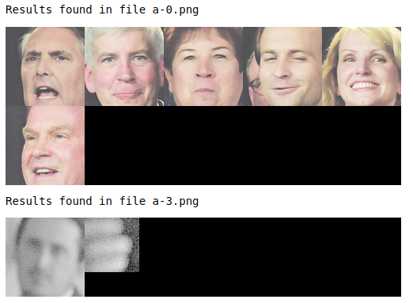
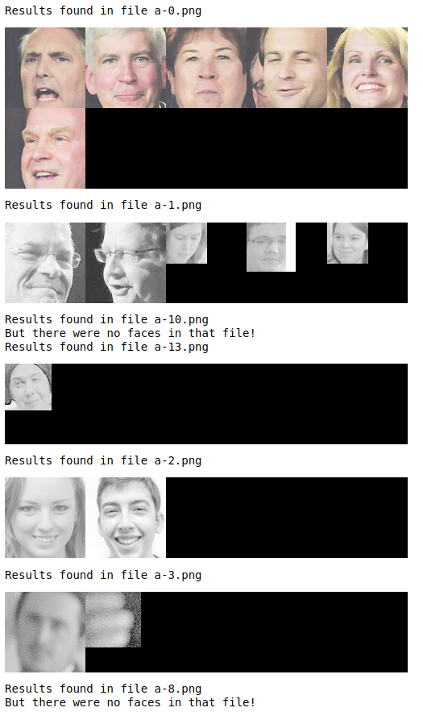

# The Project #
1. This is a project with minimal scaffolding. Expect to use the the discussion forums to gain insights! It’s not cheating to ask others for opinions or perspectives!
2. Be inquisitive, try out new things.
3. Use the previous modules for insights into how to complete the functions! You'll have to combine Pillow, OpenCV, and Pytesseract
4. There are hints provided in Coursera, feel free to explore the hints if needed. Each hint provide progressively more details on how to solve the issue. This project is intended to be comprehensive and difficult if you do it without the hints.

### The Assignment ###
Take a [ZIP file](https://en.wikipedia.org/wiki/Zip_(file_format)) of images and process them, using a [library built into python](https://docs.python.org/3/library/zipfile.html) that you need to learn how to use. A ZIP file takes several different files and compresses them, thus saving space, into one single file. The files in the ZIP file we provide are newspaper images (like you saw in week 3). Your task is to write python code which allows one to search through the images looking for the occurrences of keywords and faces. E.g. if you search for "pizza" it will return a contact sheet of all of the faces which were located on the newspaper page which mentions "pizza". This will test your ability to learn a new ([library](https://docs.python.org/3/library/zipfile.html)), your ability to use OpenCV to detect faces, your ability to use tesseract to do optical character recognition, and your ability to use PIL to composite images together into contact sheets.

Each page of the newspapers is saved as a single PNG image in a file called [images.zip](./readonly/images.zip). These newspapers are in english, and contain a variety of stories, advertisements and images. Note: This file is fairly large (~200 MB) and may take some time to work with, I would encourage you to use [small_img.zip](./readonly/small_img.zip) for testing.

Here's an example of the output expected. Using the [small_img.zip](./readonly/small_img.zip) file, if I search for the string "Christopher" I should see the following image:

If I were to use the [images.zip](./readonly/images.zip) file and search for "Mark" I should see the following image (note that there are times when there are no faces on a page, but a word is found!):


Note: That big file can take some time to process - for me it took nearly ten minutes! Use the small one for testing.


```python
import zipfile

import PIL
from PIL import Image
import pytesseract
import cv2 as cv
import numpy as np

# loading the face detection classifier
face_cascade = cv.CascadeClassifier('readonly/haarcascade_frontalface_default.xml')

# the rest is up to you!
import os
import pickle

```


```python
# Extract the images from zip file
small_zip = 'readonly/small_img.zip'
with zipfile.ZipFile(small_zip, 'r') as zip:
    zip.extractall('small_img')
    print('Done Extracting!')

big_zip = 'readonly/images.zip'
with zipfile.ZipFile(big_zip, 'r') as zip:
    zip.extractall('images')
    print('Done Extracting!')
```


```python
def create_corpus(folder):
    text_dict = {}
    try:
        with open(f"{folder}_corpus.pkl", 'rb') as file:
            text_dict = pickle.load(file)
        print("Existing corpus found. Skipping OCR.")
    except:
        print("Existing corpus not found. Running OCR on images")
        with zipfile.ZipFile(f"readonly/{folder}.zip","r") as zip:
            for info in zip.infolist():
                image = Image.open(folder + "/" + info.filename)
                print(f'running OCR on {info.filename}')
                text = pytesseract.image_to_string(image).replace('-\n','')
                text_dict[info.filename] = text
        with open(f"{folder}_corpus.pkl", 'wb') as file:
            pickle.dump(text_dict, file)
            return text_dict
```


```python
# Get texts from the all the images in small_img and images folder
# Store them in dictionary where the keys are the names of the images

texts_small = create_corpus('small_img')
texts_big = create_corpus('images')
```

    Existing corpus not found. Running OCR on images
    running OCR on a-0.png
    running OCR on a-1.png
    running OCR on a-2.png
    running OCR on a-3.png


```python
# Save the corpus on disk for future use

with open('small_img_corpus.pkl', 'wb') as f:
    pickle.dump(texts_small, f)
with open('images_corpus.pkl', 'wb') as f:
    pickle.dump(texts_big, f)
```


```python
def search(folder,keyword):
    corpus = texts_small if folder == 'small_img' else texts_big
    with zipfile.ZipFile(f"readonly/{folder}.zip","r") as zip:
        for info in zip.infolist():
            image = Image.open(folder + "/" +info.filename)
            text = corpus[info.filename]
        
            if keyword in text:
                print('Results found in file',info.filename)

                try:
                    faces = (face_cascade.detectMultiScale(np.array(image),1.4,4)).tolist()
                    
                    face_img = []

                    for x,y,w,h in faces:
                        face_img.append(image.crop((x,y,x+w,y+h)))

                    contact_sheet = Image.new(image.mode, (550,110*int(np.ceil(len(face_img)/5))))

                    x = 0
                    y = 0

                    for img in face_img:
                        img.thumbnail((110,110))
                        contact_sheet.paste(img, (x, y))
                        if x+110 == contact_sheet.width:
                            x=0
                            y=y+110
                        else:
                            x=x+110

                    display(contact_sheet)
                except:
                    print('But there were no faces in that file!')
```


```python
keyword = input("Enter the string to be searched: ")
search("small_img",keyword)
```

    Enter the string to be searched: Christopher
    Results found in file a-0.png


    Results found in file a-3.png


```python
keyword = input("Enter the string to be searched: ")
search("images", keyword)
```

    Enter the string to be searched: Mark
    Results found in file a-0.png


    Results found in file a-1.png


    Results found in file a-10.png


    Results found in file a-13.png


    Results found in file a-2.png


    Results found in file a-3.png


```python

```


```python

```
