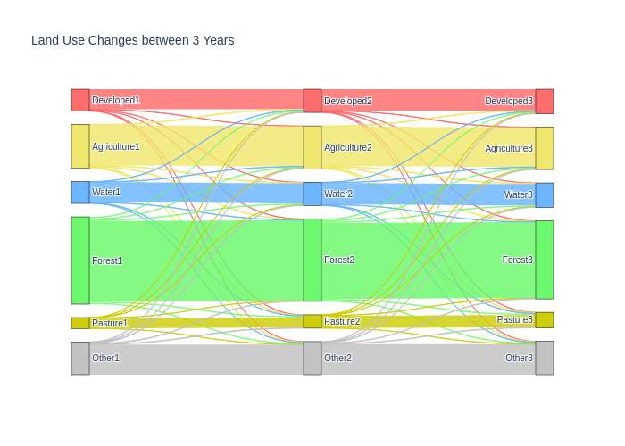

# Sankey Diagram
This notebook demonstrates how to create a sankey diagram using plotly. A sankey diagram is a type of flow diagram that shows the flow or transition of quantities between different nodes. In this example, the nodes represent different land use classes, and the links represent the changes in land use over three years.

The notebook consists of the following sections:

- [Simulate land use changes over two years](#1)
- [Simulate land use changes over three years](#2)
- [Define functions to calculate confusion matrices and create sankey texts](#3)
- [Define a list of colors for each land use ](#4)
- [Create and display the sankey diagram](#5)
- [Save the sankey diagram](#6)

# Install Kaleido and restart runtime
Kaleido is a cross-platform library for generating static images from web-based visualization libraries like plotly. It is required for the `fig.write_image` function to work. To install kaleido, we use the pip command:


```python
! pip install -U kaleido -q
```

After installing kaleido, we need to restart the runtime in Google Colab to load the package properly. We can do this by clicking on __Runtime > Restart Runtime__ in the __menu__. Then we can re-run our code to create and save the sankey diagram.

# Define the number of classes and confusion matrices
This cell defines two variables: `num_classes` and num_confusion_matrices. The `num_classes` variable stores the number of land use classes that we have in our data, which is 6. The `num_confusion_matrices` variable stores the number of confusion matrices that we will use to compare the land use labels across different years, which is 2. These variables will be used later to create the nodes and links for the sankey diagram.


```python
num_classes = 6
num_confusion_matrices = 2
```

<a name="1"></a>
# Simulate land use changes over two years

In this code cell, we import numpy and define a list of classes for different types of land use. Then we create an array of 10 million random labels for the land use in year 1, using a given probability distribution. Next, we randomly select 10% of the labels and change them to a different class, simulating the land use changes in year 2. Finally, we calculate the proportion of labels that remain the same between year 1 and year 2.


```python
import numpy as np
classes = ["Developed", "Agriculture",  "Water", "Forest", "Pasture", "Other"]

year1 = np.random.choice(np.arange(num_classes), size  = 10000000, p = np.array([0.1,0.2,0.1,0.4,0.05,0.15]))
changes = np.unique(np.sort(np.random.randint(0, year1.shape[0], size = int(year1.shape[0]*0.1))))
year2 = np.copy(year1)
year2[changes] = np.random.randint(0,6,size=changes.shape[0])
np.mean(year1 == year2)
```


    0.9206753


<a name="2"></a>
# Simulate land use changes over three years

In this code cell, we extend the previous simulation to include a third year. We randomly select another 10% of the labels and change them to a different class, simulating the land use changes in year 3. Then we calculate the proportion of labels that remain the same between year 2 and year 3, and between year 1 and year 3.


```python
changes2 = np.unique(np.sort(np.random.randint(0, year1.shape[0], size = int(year1.shape[0]*0.1))))
year3 = np.copy(year2)
year3[changes2] = np.random.randint(0,6,size=changes2.shape[0])
np.mean(year2 == year3), np.mean(year1 == year3)
```


    (0.9206494, 0.8488998)


<a name="3"></a>
# Define functions to calculate confusion matrices and create sankey texts

In this code cell, we define two functions: confusion_matrix and create_sankytext. The confusion_matrix function takes two arrays of labels and returns a confusion matrix that shows how many samples have each pair of true and predicted labels. The create_sankytext function takes a confusion matrix, a list of classes, and two indices for the source and target node groups, and returns a text that can be passed to a website to generate a sankey diagram. The website url is also provided in the docstring of the function.

We then use the confusion_matrix function to calculate the confusion matrices for year 1 and year 2, and for year 2 and year 3.


```python
def confusion_matrix(y1, y2):
    """
    Calculates the confusion matrix for two arrays of labels.

    Parameters
    ----------
    y1 : array-like of shape (n_samples,)
        The true labels of the samples.
    y2 : array-like of shape (n_samples,)
        The predicted labels of the samples.

    Returns
    -------
    counts_mat : array-like of shape (n_classes, n_classes)
        The confusion matrix, where counts_mat[i, j] is the number of samples
        with true label i and predicted label j.
    """
    nclass = len(np.unique(np.hstack((year1, year2))))
    counts_mat = np.zeros(shape=(nclass, nclass))
    for i in range(len(y1)):
        row = y1[i]
        col = y2[i]
        counts_mat[row, col] += 1
    return counts_mat

cm1 = confusion_matrix(year1, year2)
cm2 = confusion_matrix(year2, year3)

def create_sankytext(cm, classes, n, m):
    """
    Creates a text to be passed to a website to generate a sankey diagram.

    Parameters
    ----------
    cm : array-like of shape (n_classes, n_classes)
        The confusion matrix, where cm[i, j] is the number of samples
        with true label i and predicted label j.
    classes : list of str
        The names of the classes.
    n : int
        The index of the source node group.
    m : int
        The index of the target node group.

    Returns
    -------
    text : str
        The text to be passed to the website, where each line has the format:
        "class_n [value] class_m", where class_n and class_m are the names of the
        source and target classes, and value is the number of samples with those labels.

    Website
    -------
    https://www.sankeymatic.com/build/
    """
    text = []
    for i in range(cm.shape[0]):
        for j in range(cm.shape[1]):
            text.append(classes[i]+ str(n) + " [" + str(int(cm1[i,j])) +"] " + classes[j] + str(m))
    return "\n".join(text)

#print(create_sankytext(cm1, classes, 1,2))
#print(create_sankytext(cm2, classes, 2,3))
```

<a name="4"></a>
# Define a list of colors for each land use class
This cell defines a list of colors in RGBA format for each of the six land use classes: Developed, Agriculture, Water, Forest, Pasture, and Other. 


```python
colors = ["rgba(255, 102, 102, 0.95)", # light coral for developed
          "rgba(240, 230, 103, 0.95)", # darker yellow for agriculture
          "rgba(102, 178, 255, 0.95)", # light blue for water
          "rgba(102, 248, 102, 0.95)", # light green for forest
          "rgba(204, 204, 0, 0.95)", # olive for pasture
          "rgba(192, 192, 192, 0.95)"] # silver for other
```

<a name="5"></a>
# Create and display the sankey diagram
Now let's use the plotly.graph_objects library to create a sankey diagram. The node attribute defines the properties of the nodes, such as their padding, thickness, line color, label, and color. The label is created by appending the year number to each class name. The link attribute defines the properties of the links, such as their source, target, value, label, and color. The source and target are indices that correspond to the labels of the nodes. The value and label are derived from the confusion matrices that show the number of samples with each pair of true and predicted labels. The color is a slightly transparent version of the node color. The figure is then updated with a title and a font size, and displayed using the show method.


```python
import plotly.graph_objects as go

fig = go.Figure(data=[go.Sankey(
    node = dict(
      pad = 15,
      thickness = 20,
      line = dict(color = "black", width = 0.5),
      label = [i + "1" for i in classes] + [i + "2" for i in classes] + [i + "3" for i in classes],
      color = colors*3
    ),
    link = dict(
      source = [x for x in [0,1,2,3,4,5] for _ in range(6)] + [x for x in [6,7,8,9,10,11] for _ in range(num_classes)], # indices correspond to labels, eg A1, A2, A1, B1, ...
      target = [6,7,8,9,10,11]*num_classes + [12,13,14,15,16,17]*num_classes,
      value = [int(i) for i in cm1.ravel().tolist() + cm2.ravel().tolist()],
      label = [int(i) for i in cm1.ravel().tolist() + cm2.ravel().tolist()],
      color = [i.replace("0.95", "0.8") for i in [x for x in colors for _ in range(num_classes)] *num_confusion_matrices]
  ))])

fig.update_layout(title_text="Land Use Changes between 3 Years", font_size=10)
fig.show()
```


<a name="6"></a>
# Save the sankey diagram
we can use `fig.write_image` method to save the image as a static image or `fig.write_html` to export it as a webpage.


```python
fig.write_image("sankey.png")
fig.write_html("sankey.html")
```

I hope you have enjoyed this tutorial on how to create a sankey diagram using plotly. You have learned how to use plotly to visualize the flow of data between different categories and how to customize the appearance and interactivity of the sankey diagram. Happy plotting!
