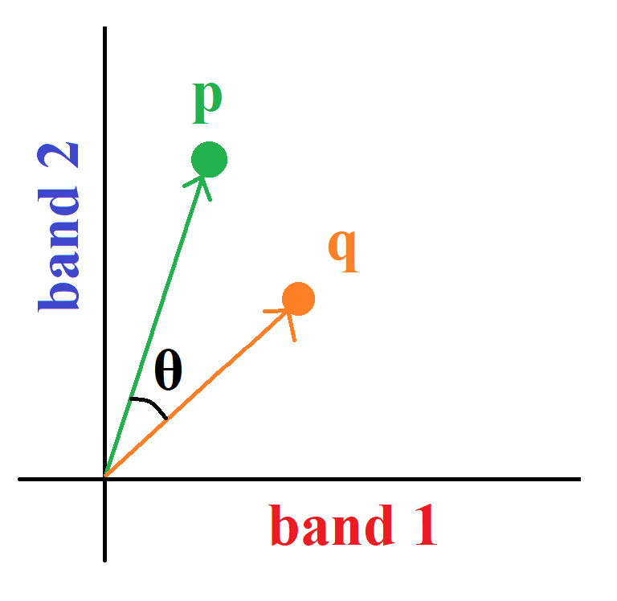

## Classification using Spectral Angle Mapper

This exercise guides through the process of running spectral angle mapper method for hyperspectral image classification.
The spectral angle can also be used as additional feature much like band indices to provide additional feature for multispectral image classification.
This method requires only single example of each class, but a mean vector of multiple examples for each class can improve the accuracy. Here we will use single example for each class.

The implementations are based on the paper [Rashmi, S. et al. “Spectral Angle Mapper Algorithm for Remote Sensing Image Classification.” (2014).](https://ijiset.com/v1s4/IJISET_V1_I4_27.pdf)

### Content
1. [Loading required packages](#1)
2. [Reading Hyperspectral Image](#2)
3. [Representative data for each class](#3)
4. [Obtaining spectral signature of sample locations](#4)
5. [Spectral Angle](#5)
6. [Helper Functions](#6)
7. [Run the classification](#7)

<a name = '1'></a>

### 1. Loading required packages


```python
import matplotlib.pyplot as plt
%matplotlib inline

from osgeo import gdal
import numpy as np
import glob
import gc
import os
```

<a name = '2'></a>
### 2. Reading Hyperspectral Image
The image that will be used here is a [EO-1 Hyperion](https://www.usgs.gov/centers/eros/science/usgs-eros-archive-earth-observing-one-eo-1-hyperion) Scene, downloaded from [USGS Earth Explorer](https://earthexplorer.usgs.gov/) website.

Hyperspectral image has more than 100 bands. When downloaded, each of these bands are in seperate geotiff files. We can read each of these files and stack them on top of each other to form the hyperspectral `fullimage`.


```python
#os.chdir(<path to folder containing bands of multispectral image)

lst = []
for name in glob.glob('*.tif'):
    if len(name) < 15:
        continue
    ds = gdal.Open(name)
    arr = ds.ReadAsArray()
    lst.append(arr)

fullimage = np.dstack(lst)
del lst
gc.collect()
```


    0


<a name = '3'></a>
### 3. Representative data for each class
Here, we have obtained the location of 4 points of interests that represent a class each. These can be obtanined from google earth or desktop GIS softwares by placing points on features of interest on basemap and calculating their X and Y co-ordinates.
Make sure that the `crs` of the points is same as that of the raster bands of hyperspectral image.


```python
samples_loc = [(699799.3271,3612738.818),
(702984.4934,3615303.715),
(696597.3967,3610643.314),
(702967.7294,3613945.829)
]
```

<a name = '4'></a>
### 4. Obtaining spectral signature of sample locations
We will create some helper functions to make perform some basic operations. First, a function `map_to_pixel` is created, which will help us to find the `row` and `column` on the hyperspectral `fullimage` on which a `point` falls.

Next, we will create a function `plot_signatures` to plot the spectral signatures of sample locations.


```python
def map_to_pixel(point_x, point_y, cellx, celly, xmin, ymax):
    '''
    Finds out on which row and column of the image the given point falls on
    
    Inputs:
    point_x, pointy: X and Y co-ordinates of the point
    cellx, celly: the x and y direction cell size of the raster
    xmin, ymax: X and Y co-ordinates of the top left corner of the raster
    
    Returns:
    row, col: row and column number of the raster pixel corresponding to the location of the input point
    '''
    row = int((point_y - ymax) / celly)
    col = int((point_x - xmin) / cellx)
    return row, col
```


```python
def plot_signatures(samples, legend = False):
    '''
    Plots the spectral signature of given samples.
    
    Inputs:
    samples: A numpy array of shape (n_C, n_B) where n_C is the number of classes and n_B
    is the number of spectral bands.
    
    legend: A list of length n_C corresponding to the class of each of the samples,
    if legend is False, a default legend will be shown.
    '''
    for each in samples:
        plt.plot(each)
    if not legend:
        legend = [ f'class {i}' for i in range(samples.shape[0])]
    plt.legend(legend)
    plt.show()
```

Now, we will use the helper functions to get the `row` and `column` number for each of the `samples` location and finally obtain their __spectral signature__ from the hyperspectral image and visualize them.


```python
samples = []

props = ds.GetGeoTransform()
xmin, cellx, _, ymax, _, celly = props
    
for point in samples_loc:   
    point_x = point[0]
    point_y = point[1]

    row, col = map_to_pixel(point_x, point_y, cellx, celly, xmin, ymax)
    samples.append(fullimage[row, col,:])
samples = np.array(samples)
```


```python
plot_signatures(samples)
```

<a name = '5'></a>
### 5. Spectral Angle
A spectral vector is the an `n_B` dimensional vector where each component of the vector is its reflectance in the corresponding band.
A vector has two basic properites: magnitude and direction.

Due to the directional nature of vector, we can compute the angle between two vectors.

If two vectors are similar, then the angle between these two vectors in small. The spectral angle classification is not affected by the changes in illumination that affects all the band in similar way as it only considers the angle and not the magnitude of spectral vector.
For vectors $\vec{p} $ and $\vec{q} $, their dot product is given by the formula,



$\vec{p} \cdot \vec{q}=\left | \vec{p} \right |\left | \vec{q} \right |\cos\theta $

where  $\left | \vec{p} \right |$ = the length of vector $\vec{p}$ <br>
    &emsp; &emsp; $\left | \vec{q} \right |$ = the length of vector  $\vec{q}$ and <br>
    &emsp; &emsp; $\cos\theta$  = the angle between$\vec{p}$  and  $\vec{q}$

So, the angle between two vectors is,
$\theta = {\cos^{-1}} \left( \dfrac{\vec{p} \cdot \vec{q}}{\left | \vec{p} \right | \left | \vec{q} \right |} \right)$

We will use the generalization of this concept from 2D to higher dimensional vectors.
We will use `np.linalg.norm` method to calculate the length of the __spectral signature__ and `np.dot` method to calculate their dot products.

<a name = '6'></a>
### 6. Helper Functions
We will now define a few more helper functions. First, the `calculate_angle` function to calculate the spectral angle between each of the pixel and the each of the sample.

Next, the `predict_classes` function, which will use the spectral angle matrix generated by the first function and assign each pixel to a class for which it has smallest spectral angle.

Next, the `write_array2raster` function to write an `array` as a `raster` on disk, so that it can be open on GIS software.

Finally, we will define `classify_sam` function to combine all the above functions and classify an input `image` using the spectal angle. It will return a classification array, which we can plot as well as save on disk.


```python
def calculate_angle(clean, samples):
    '''
    Calculates spectral angle between a pixel and each of the samples, for all the pixels in the clean data
    
    Inputs:
    clean: A numpy array of shape (m, n_B), where m is the number of pixels
    and n_B is the number of bands
    samples: A numpy array of shape (n_C, n_B) where n_C is the number of classes and n_B
    is the number of spectral bands
    
    Returns:
    A numpy array of shape (m, n_C) where each value in position i,j represents the spectral
    angle between the pixel i and class j
    
    '''
    results = np.zeros((len(clean), len(samples)))
    normc = np.linalg.norm(clean, axis =-1) 
    for j, sample in enumerate(samples):
        results[:,j] = ((np.dot(clean, sample)/normc)/np.linalg.norm(sample))

    return np.arccos(results)*180/np.pi
```


```python
def predict_classes(sa_matrix, threshold = 10):
    '''
    Predicts the classes of each row based on the spectral angles to each of the classes.
    
    Inputs:
    sa_matrix: A numpy array of shape (m, n_C) where m is the number of pixels and
    n_C is the number of classes
    
    threshold: An angle value in degree. If any pixel with more than this value away from all the classes,
    that pixel will be unclassified
    
    Outputs:
    classes: A numpy array of length m, where each entry corresponds to the assigned class to the corresponding pixel
    '''
    classes = np.argmin(sa_matrix, axis = -1)
    values = (np.min(sa_matrix, axis = -1) > threshold)
    classes[values] = -1
    return classes
    
```


```python
def write_array2raster(array, rastername, reference, band_dim = 2):
    '''
    Writes an array to a raster on disk using the spatial reference of the reference dataset
    
    Inputs:
    array: image like array
    rastername: name to save the output raster to. Should end with .tif
    reference: spatial dataset whose geotransform and projection will be applied to output raster
    '''
    nbands = 1
    if array.ndim > 2:
        nbands = array.shape[2]

    driver_gtiff = gdal.GetDriverByName('GTiff')

    ds_create = driver_gtiff.Create(rastername, xsize = array.shape[1], ysize=array.shape[0], bands = nbands)
    
    if nbands > 1:
        for band in range(1, nbands + 1):
            ds_create.GetRasterBand(band).WriteArray(array[:,:,band-1])
    else:
        ds_create.GetRasterBand(1).WriteArray(array)

    ds_create.SetProjection(reference.GetProjection())
    ds_create.SetGeoTransform(reference.GetGeoTransform())
    ds_create.GetRasterBand(1).FlushCache()
    ds_create.FlushCache()
```


```python
def classify_sam(full_image, samples, save_sa_matrix_params= {'name': 'sa_matrix.tif', 'reference': ds}):
    '''
    Performs the spectral angle calculation, class assignment and visualization
    
    Inputs:
    imgreshaped: A numpy array of shape (m, n_B) where m in the number of pixels and
    n_B is the number of spectral bands
    
    samples: A numpy array of shape (n_C, n_B) where n_C is the number of classes and n_B
    is the number of spectral bands
    
    save_sa_matrix_as: a dictionary specifying the name and reference to be used for saving spectral angle values as a raster
    '''
    imgreshaped = fullimage.reshape((-1,fullimage.shape[2])).astype(np.int64)
    sa_matrix = calculate_angle(imgreshaped, samples)
    
    if save_sa_matrix_params:
        sa_raster_name = save_sa_matrix_params['name']
        reference = save_sa_matrix_params['reference']
        write_array2raster(sa_matrix.reshape((fullimage.shape[0], fullimage.shape[1], len(samples))), \
                           sa_raster_name, reference)        
        
    results = predict_classes(sa_matrix).reshape(fullimage.shape[:2])
    plt.imshow(results, cmap = 'Dark2')
    plt.colorbar()
    return results
```

<a name = '7'></a>
### 7. Run the classification
Finally, to actually run the classification, we will call the `classify` with the hyperspectral `fullimage` and `samples` locations. Then we will write this classificatfion output as raster.


```python
results = classify_sam(fullimage, samples)
write_array2raster(results, 'sam.tif', ds)
```
